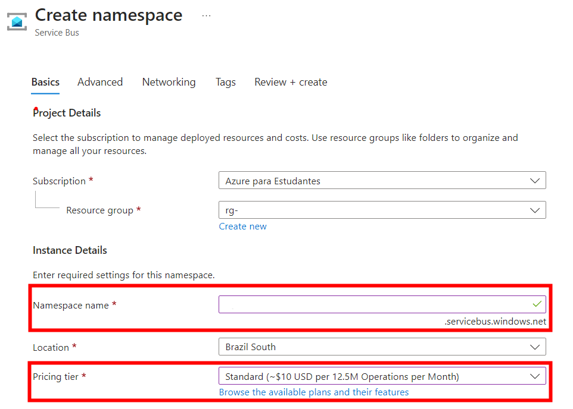
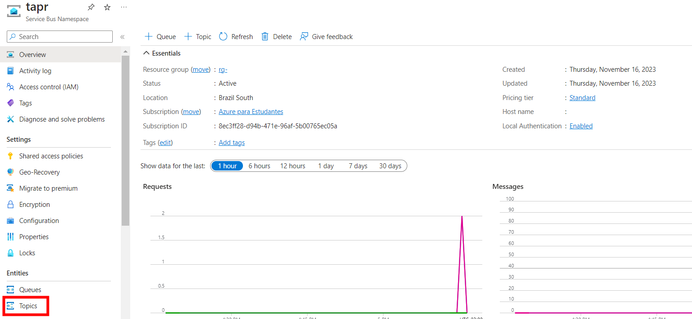
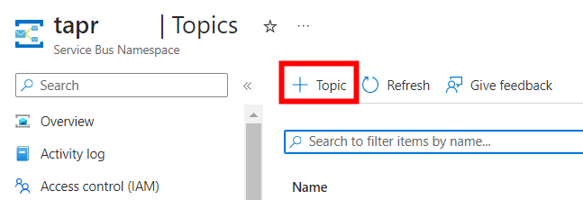
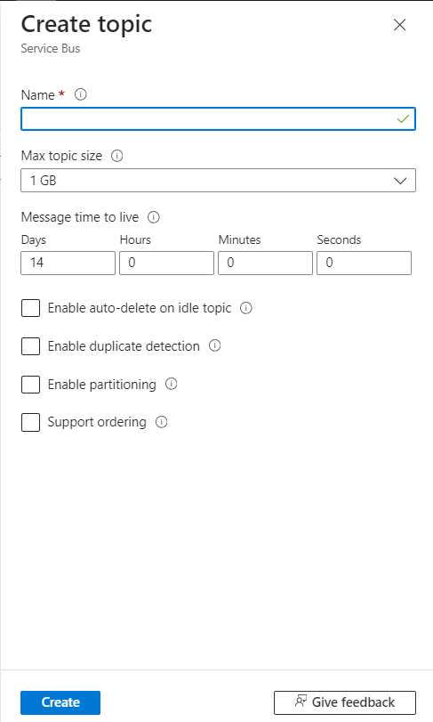
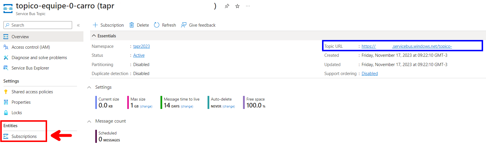
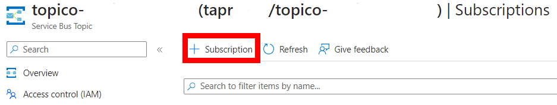
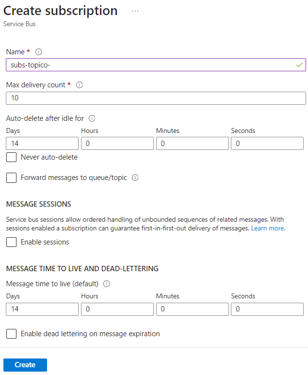
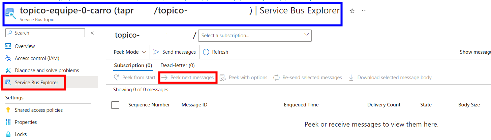

# tapr-2024-turmab-colegio-java

## Documentação do projeto
[Diagramas](https://univillebr-my.sharepoint.com/:u:/g/personal/walter_s_univille_br/EWtm7BQwjlJJgXsTxgdj9UIB6YYhdA9x5ufNfKxCAtlKVg?e=cl21Nh)

## Extensões do VSCode
[Extension Pack for Java](https://marketplace.visualstudio.com/items?itemName=vscjava.vscode-java-pack?wt.mc_id=AZ-MVP-5003638)

[Spring Boot Extensio Pack](https://marketplace.visualstudio.com/items?itemName=vmware.vscode-boot-dev-pack?wt.mc_id=AZ-MVP-5003638)

[Rest Client](https://marketplace.visualstudio.com/items?itemName=humao.rest-client?wt.mc_id=AZ-MVP-5003638)

## Criação do projeto
1. Pressionar F1
2. >Spring Initializr: create a Maven Project
3. Versão 3.3.4
4. Languages: Java
5. Package: br.univille
6. Name: microserv<nome do subdominio>
7. Pacote: jar
8. Jave: 17
9. Dependencias: Spring Web e Devtools

10. Criar um namespace com o nome de cada Bounded Context
11. Criar um namespace chamado Entities e dentro dele criar as entidades
```
├── src
│   ├── main
│   │   ├── java
│   │   │   └── br
│   │   │       └── univille
│   │   │           └── microservcolegio
│   │   │               ├── MicroservcolegioApplication.java
│   │   │               └── secretaria
│   │   │                   └── entity
│   │   │                       └── Aluno.java
```

## Cosmos DB
[Introdução (https://learn.microsoft.com/en-us/azure/cosmos-db/introduction?wt.mc_id=AZ-MVP-5003638)](https://learn.microsoft.com/en-us/azure/cosmos-db/introduction?wt.mc_id=AZ-MVP-5003638)

[Databases, Containers e Itens (https://learn.microsoft.com/en-us/azure/cosmos-db/resource-model?wt.mc_id=AZ-MVP-5003638)](https://learn.microsoft.com/en-us/azure/cosmos-db/resource-model?wt.mc_id=AZ-MVP-5003638)

```
docker run \
    --publish 8081:8081 \
    --publish 10250-10255:10250-10255 \
    --name cosmosdb-linux-emulator \
    --detach \
    mcr.microsoft.com/cosmosdb/linux/azure-cosmos-emulator:latest    
```
### Instalação do certificado
```
curl --insecure https://localhost:8081/_explorer/emulator.pem > ~/emulatorcert.crt
```
```
sudo cp ~/emulatorcert.crt /usr/local/share/ca-certificates/
```
```
sudo update-ca-certificates
```

1) Abrir a extensão do docker e startar o container do cosmosdb
2) menu de hamburguer -> arquivo -> preferencias -> configurações,  procurar por http.proxyStrictSSL e desabilitar a opção

### IMPORTANTE: nas configurações do CodeSpace desabilitar a opção http.proxyStrictSSL

### Extensão do VSCode
[Azure Databases](https://marketplace.visualstudio.com/items?itemName=ms-azuretools.vscode-cosmosdb?wt.mc_id=AZ-MVP-5003638)

### Endpoint do simulador
```
AccountEndpoint=https://localhost:8081/;AccountKey=C2y6yDjf5/R+ob0N8A7Cgv30VRDJIWEHLM+4QDU5DE2nQ9nDuVTqobD4b8mGGyPMbIZnqyMsEcaGQy67XIw/Jw==;
```

### Geração do SSL Key Store
- IMPORTANTE: utilizar a senha univille
```
cd /workspaces/tapr-2024-turmab-<NOME DO SEU PROJETO>-java
keytool -importcert -file ~/emulatorcert.crt -keystore native.jks -alias cosmosdb
```
- Alterar o arquivo launch.json para incluir os parâmetros de VM
```
    "vmArgs": ["-Djavax.net.ssl.trustStore=/workspaces/tapr-2024-turmab-<NOME DO SEU PROJETO>-java/native.jks",
               "-Djavax.net.ssl.trustStorePassword=univille"]
```
### Modelagem de dados
[Modeling Data](https://learn.microsoft.com/en-us/azure/cosmos-db/nosql/modeling-data?wt.mc_id=AZ-MVP-5003638)

### Particionamento
[Partitioning](https://learn.microsoft.com/en-us/azure/cosmos-db/partitioning-overview?wt.mc_id=AZ-MVP-5003638)

### Erro CORS
- [O que é o erro de CORS](https://pt.wikipedia.org/wiki/Cross-origin_resource_sharing#:~:text=Cross-origin%20resource%20sharing%20%E2%80%93%20Wikip%C3%A9dia%2C%20a%20enciclop%C3%A9dia%20livre,pertence%20o%20recurso%20que%20ser%C3%A1%20recuperado.%20%5B%201%5D)


#### Solução
- Criaruma pasta config
- Criar a classe WebConfig.java
```
package br.edu.univille.microservcolegio.config;

import org.springframework.context.annotation.Configuration;
import org.springframework.web.servlet.config.annotation.CorsRegistry;
import org.springframework.web.servlet.config.annotation.EnableWebMvc;
import org.springframework.web.servlet.config.annotation.WebMvcConfigurer;

@Configuration
@EnableWebMvc
public class WebConfig implements WebMvcConfigurer  {

    @Override
    public void addCorsMappings(CorsRegistry registry) {
        registry.addMapping("/**");

    }
}
```

## CRUD API REST
### Verbo GET e POST
- Objetivo: Retornar uma lista de objetos ou salvar um objeto

#### AlunoService.java
- Criar os métodos na interface do serviço

```
package br.univille.microservcolegio.secretaria.service;
import java.util.List;

import br.univille.microservcolegio.secretaria.entity.Aluno;

public interface AlunoService {
    
    List<Aluno> getAll();
    Aluno save(Aluno aluno);

```
#### AlunoServiceImpl.java
- Implementar a lógica de consulta na classe concreta do serviço
```
package br.univille.microservcolegio.secretaria.service.impl;

import java.util.List;
import java.util.ArrayList;

import org.springframework.beans.factory.annotation.Autowired;
import org.springframework.stereotype.Service;

import br.univille.microservcolegio.secretaria.entity.Aluno;
import br.univille.microservcolegio.secretaria.repository.AlunoRepository;
import br.univille.microservcolegio.secretaria.service.AlunoService;

@Service
public class AlunoServiceImpl 
    implements AlunoService{

    @Autowired
    private AlunoRepository repository;

    @Override
    public List<Aluno> getAll() {
        var retorno = repository.findAll();
        List<Aluno> listaAlunos = new ArrayList<Aluno>();
        retorno.forEach(listaAlunos::add);

        return listaAlunos;
    }

    @Override
    public Aluno save(Aluno aluno) {
        return repository.save(aluno);
    }

```

#### AlunoAPIController.java
- Implememntar no controlador os métodos para buscar do banco todos os aluno e salvar um aluno

```
package br.univille.microservcolegio.secretaria.controller;

import org.springframework.beans.factory.annotation.Autowired;
import org.springframework.http.HttpStatus;
import org.springframework.http.ResponseEntity;
import org.springframework.web.bind.annotation.GetMapping;
import org.springframework.web.bind.annotation.PostMapping;
import org.springframework.web.bind.annotation.RequestBody;
import org.springframework.web.bind.annotation.RequestMapping;
import org.springframework.web.bind.annotation.RestController;

import br.univille.microservcolegio.secretaria.entity.Aluno;
import br.univille.microservcolegio.secretaria.service.AlunoService;
import java.util.List;

@RestController
@RequestMapping("/api/v1/alunos")
public class AlunoAPIController {

    @Autowired
    private AlunoService service;

    @GetMapping
    public ResponseEntity<List<Aluno>> get(){
        var listaAlunos = service.getAll();

        return new ResponseEntity<List<Aluno>>(listaAlunos,HttpStatus.OK);
    }
    @PostMapping
    public ResponseEntity<Aluno> post(@RequestBody Aluno aluno){
        if(aluno == null){
            return new ResponseEntity<>(HttpStatus.BAD_REQUEST);
        }
        var alunoSalvo = service.save(aluno);

        return new ResponseEntity<Aluno>(alunoSalvo, HttpStatus.OK);
    }

}
```

#### teste.rest
- Implementação do teste do verbo GET e POST

```
### Buscar todos os alunos
GET http://localhost:8080/api/v1/alunos

### Inserir um aluno
POST http://localhost:8080/api/v1/alunos
Content-Type: application/json

{
    "nome" : "zezinho"
}
```
# Azure Service Bus
- [Documentação](https://azure.microsoft.com/pt-br/products/service-bus)
- Passo 1: Criar uma instância do recurso Service Bus, informando o namespace name e o pricing tier Standard (a partir desse SKU há suporte a tópicos)

- Passo 2: Uma vez provisionado, clicar no menu tópicos

- Passo 3: Clicar no link para criar um novo tópico

- Passo 4: Informar o nome do tópico no padrão topico-<NOMEDOMICROSERVICO>-<NOMEDAENTIDADE>

- Passo 5: Uma vez que o tópico seja provisionado, clicar em subscriptions

- Passo 6: Clicar no link para criar uma nova subscription

- Passo 7: Informar o nome da assinatura no padrão subs-topico-<NOMEDOMICROSERVICO>-<NOMEDAENTIDADE>

- Passo 8: Clicar no ícone Service Bus Explorer para monitorar as mensagens



# Dapr
- Dapr é um runtime para construção, integração, execução e monitoramento de aplicações distribuídas no formato de microsserviços

- [Building blocks](https://docs.dapr.io/concepts/overview/#microservice-building-blocks-for-cloud-and-edge)

## Instalação
- [Instalação do Dapr CLI](https://docs.dapr.io/getting-started/install-dapr-cli/)

## Inicialização
```
cd microservcarro
dapr init
```

- Verificando a instalação
```
$ docker ps
CONTAINER ID   IMAGE                COMMAND                  CREATED          STATUS                    PORTS                                                                                                                                     NAMES
f377a492bae6   daprio/dapr:1.12.1   "./placement"            43 seconds ago   Up 42 seconds             0.0.0.0:50005->50005/tcp, :::50005->50005/tcp, 0.0.0.0:58080->8080/tcp, :::58080->8080/tcp, 0.0.0.0:59090->9090/tcp, :::59090->9090/tcp   dapr_placement
a5009c20daa7   redis:6              "docker-entrypoint.s…"   47 seconds ago   Up 44 seconds             0.0.0.0:6379->6379/tcp, :::6379->6379/tcp                                                                                                 dapr_redis
1d669098ac80   openzipkin/zipkin    "start-zipkin"           48 seconds ago   Up 44 seconds (healthy)   9410/tcp, 0.0.0.0:9411->9411/tcp, :::9411->9411/tcp                                                                                       dapr_zipkin
```

## Dependências no POM
- [SDK Java](https://docs.dapr.io/developing-applications/sdks/java/)
```
    <dependency>
      <groupId>io.dapr</groupId>
      <artifactId>dapr-sdk</artifactId>
      <version>1.10.0</version>
    </dependency>
    <!-- Dapr's SDK integration with SpringBoot (optional). -->
    <dependency>
      <groupId>io.dapr</groupId>
      <artifactId>dapr-sdk-springboot</artifactId>
      <version>1.10.0</version>
    </dependency>
```
## Componentes Dapr
- Os componentes do Dapr são recursos utilizados pelos microsserviços que são acessados através do sidecar.
- [Dapr Components](https://docs.dapr.io/reference/components-reference/)
- Passo 1: criar uma pasta dentro de microservcarro -> components
- Passo 2: na pasta components criar o arquivo servicebus-pubsub.yaml

```
# Documentação: https://docs.dapr.io/reference/components-reference/supported-pubsub/setup-azure-servicebus/
apiVersion: dapr.io/v1alpha1
kind: Component
metadata:
  name: servicebus-pubsub
spec:
  type: pubsub.azure.servicebus.topics
  version: v1
  metadata:
  - name: namespaceName
    value: "<DNS DO SERVICE BUS NO AZURE>"
```

- Passo 3.1: na pasta do projeto executar o comando.

```
mvn clean install
```

- Passo 3.2: na pasta principal do projeto (mesma pasta do arquivo pom.xml), criar um novo arquivo com o nome dapr.yaml
```
version: 1
common:
  resourcesPath: ./components/
apps:
  - appID: tapr-2024-NOMEDOMICROSERVICO-java
    appDirPath: ./target/
    appPort: 8080
    command: ["java", "-jar", "NOMEDOARQUIVOJARCOMOPROJETO-SNAPSHOT.jar"]

```

## Publicação de atualizações da entidade principal do agregado

- Passo 4: alterar o arquivo application.properties para incluir dois novos parametros:
  - app.component.topic.carro=<nome do tópico registrado no service bus>
  - app.component.service=servicebus-pubsub

```
#Exemplo
app.component.topic.carro=topico-<NOMEDOMICROSERVICO>-<NOMEDAENTIDADE>
app.component.service=servicebus-pubsub
```

- Passo 5:  na classe de serviço da entidade root do agregado, incluir os seguintes códigos:

```
//outros imports...
import io.dapr.client.DaprClient;
import io.dapr.client.DaprClientBuilder;

@Service
public class CarroServiceImpl implements CarroService{

    //outros atributos...

    private DaprClient client = new DaprClientBuilder().build();
    @Value("${app.component.topic.carro}")
    private String TOPIC_NAME;
    @Value("${app.component.service}")
	private String PUBSUB_NAME;

    //método privado para publicar a atualização
    private void publicarAtualizacao(Carro carro){
        client.publishEvent(
					PUBSUB_NAME,
					TOPIC_NAME,
					carro).block();
    }

    @Override
    public Carro saveNew(Carro carro) {
        carro.setId(null);
        carro = repository.save(carro);
        publicarAtualizacao(carro);
        return carro;
    }

    @Override
    public Carro update(String id, Carro carro) {
        var buscaCarroAntigo = repository.findById(id);
        if (buscaCarroAntigo.isPresent()){
            var carroAntigo = buscaCarroAntigo.get();

            //Atualizar cada atributo do objeto antigo 
            carroAntigo.setPlaca(carro.getPlaca());
            carroAntigo = repository.save(carroAntigo);
            publicarAtualizacao(carroAntigo);
            return carroAntigo;
        }
        return null;
    }
```

## Executar o teste de publicação de eventos
```
#Executar esse comando dentro da pasta do projeto
mvn clean install
dapr run -f .
```
- Passo 6: Usar o arquivo teste.rest para invocar a API REST nos métodos POST e PUT, verificar no Azure Service Bus se os eventos foram publicados no tópico.

## Assinatura das atualizações em um tópico
- Escolher uma das entidades externas aos agregados.

- Passo 1: alterar o arquivo application.properties para incluir um novo parametro com o nome do tópico registrado no Service Bus que se deseja receber os eventos

```
app.component.topic.cliente=<nome do tópico registrado no service bus>
```

- Passo 2: Criar na classe Controller da entidade externa ao agregado um novo end point chamado atualizar, que será automaticamente chamado pelo Dapr toda vez que um novo evento for publicado no Service Bus

```
    @Topic(name = "${app.component.topic.cliente}", pubsubName = "${app.component.service}")
    @PostMapping(path = "/event", consumes = MediaType.ALL_VALUE)
    public ResponseEntity<Cliente> atualizarCliente(@RequestBody(required = false) CloudEvent<Cliente> cloudEvent){
        var cliente = service.update(cloudEvent.getData());
        return 
            new ResponseEntity<Cliente>
            (cliente, HttpStatus.OK);
    }
```
- Passo 3: alterar a classe de serviço da entidade, para incluir um método update recebendo como parâmetro apenas a classe de entidade.

```
public interface ClienteService {
    public List<Cliente> getAll();
    public Cliente getById(String id);
    public Cliente saveNew(Cliente cliente);
    public Cliente update(String id, Cliente cliente);
    public Cliente update(Cliente cliente);
}
```
- Passo 4: incluir na classe de implementação do serviço da entidade, o código do método abaixo para receber a entidade e atualizar no banco de dados local do serviço.

```
@Override
public Cliente update(Cliente cliente) {
    return repository.save(cliente);
}
```
## Executar o teste de assinatura dos eventos
```
#Executar esse comando dentro da pasta do projeto
mvn clean install
dapr run -f .
```
- Mantendo a aplicação em execução, abrir um novo terminal e executar o exemplo do comando abaixo alterando os parametros para simular a publicação de um evento.

```
#Exemplo de publicação de atualização do evento
# dapr publish --publish-app-id <nome da aplicação no arquivo dapr.yaml> --pubsub <nome do componente do service bus no arquivo /componenets/servicebus-pubsub.yaml> --topic <nome do topico registrado no service bus> --data '<objeto JSON contendo os campos da entidade>'

dapr publish --publish-app-id tapr-2024-NOMEDOMICROSERVICO-java --pubsub servicebus-pubsub --topic topico-equipe-0-cliente --data '{"id": "123","nome": "Zezinho","endereco": "Rua lalala 100"}'
```

- Verificar no banco de dados se a entidade foi registrada.


## Remover o histórico de cache do git
```
git rm -r --cached .
```
